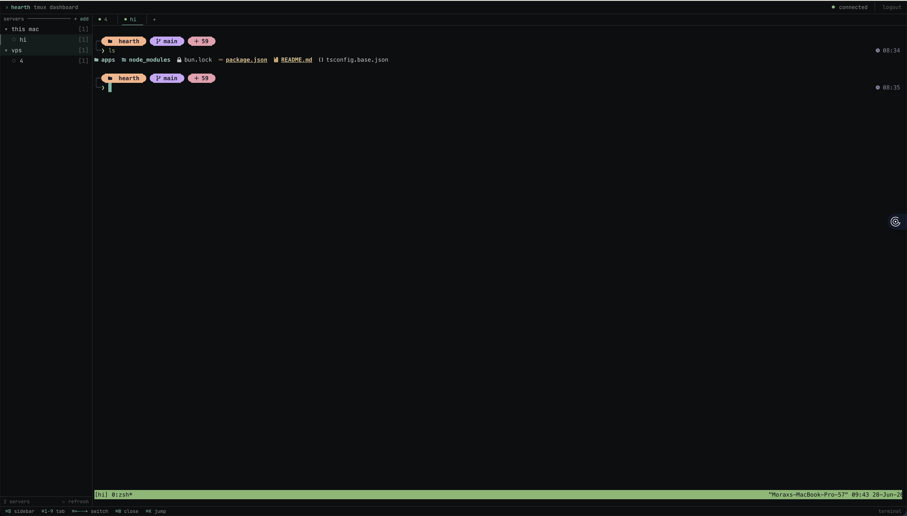
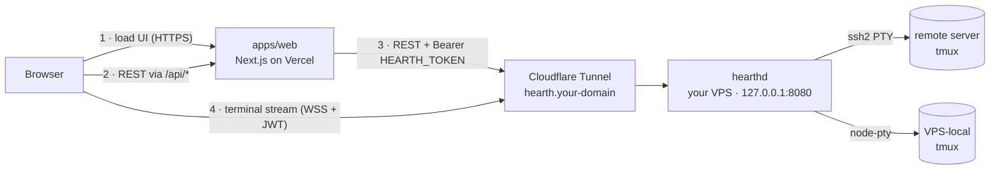

# Hearth

A browser-based **TUI** for managing [tmux](https://github.com/tmux/tmux) sessions across many
servers. Pick a session from the sidebar, drop into a full interactive terminal in your browser.
It looks and behaves like `lazygit` / `k9s` / `btop` (monospace, keyboard-first, zero chrome), not
a SaaS dashboard.



## How it works

Hearth is two apps. The split keeps the terminal stream off Vercel (serverless can't hold
long-lived WebSockets) and keeps every server credential on a machine you control.



- **`apps/web`** (`@hearth/web`): Next.js 15 + Tailwind v4 + xterm.js. Renders the UI, proxies REST
  to `hearthd` (injecting the service token server-side), and mints short-lived tokens for the
  browser's direct terminal WebSocket. Deploys to Vercel. **Never carries terminal traffic.**
- **`apps/hub`** (`@hearth/hub`, binary `hearthd`): Fastify + ssh2 + node-pty. Holds all server
  credentials. Bridges a WebSocket to `tmux new -A -s <name>` (attach-or-create) over SSH (remote)
  or node-pty (the VPS itself). Because tmux keeps sessions alive, a dropped connection simply
  re-attaches.

## Requirements

| Where | Needs |
| --- | --- |
| Your dev machine | [Bun](https://bun.sh) 1.3+ · `tmux` (only to test a local session) |
| The VPS running `hearthd` | Bun 1.3+ (install/build) · Node 20+ (runs the built daemon) · `tmux` if you host sessions on the VPS itself |
| Each target server | `tmux` installed · reachable over SSH |
| Vercel | nothing to install (managed) |

Install Bun: `curl -fsSL https://bun.sh/install | bash`

> `node-pty` (used only for a VPS-local session) is an optional native addon. Bun skips its native
> build by default, which is fine for the SSH path. To use a `local` server, install a C++ toolchain
> (Xcode CLT on macOS; `build-essential` + `python3` on Linux) and run `bun pm trust node-pty`.

## Quick start (run it locally)

This gets the full app running on your machine with a terminal into your **own Mac/Linux box** (no
remote server required).

**1. Install and build**

```bash
git clone <this-repo> hearth && cd hearth
bun install
```

**2. Generate the two shared secrets** (you'll paste the same values into both apps)

```bash
openssl rand -hex 32   # use as HEARTH_TOKEN
openssl rand -hex 32   # use as JWT_SECRET
```

**3. Configure the hub** (`apps/hub`)

```bash
cp apps/hub/.env.example apps/hub/.env
```

Edit `apps/hub/.env` and set `HEARTH_TOKEN` and `JWT_SECRET` to the values from step 2. Then create
the server list:

```bash
# A local session on this machine, no SSH (needs tmux + a built node-pty):
echo '[{ "id": "local", "name": "this machine", "local": true }]' > apps/hub/servers.json
```

(Prefer a remote box? Use `apps/hub/servers.json.example` as a template instead, see
[Server configuration](#server-configuration).)

**4. Configure the web app** (`apps/web`)

```bash
cp apps/web/.env.example apps/web/.env.local
```

Edit `apps/web/.env.local`:

```ini
HEARTH_HTTP_URL=http://localhost:8080
HEARTH_WS_URL=ws://localhost:8080
HEARTH_TOKEN=<same value as the hub>
JWT_SECRET=<same value as the hub>
DASHBOARD_PASSWORD=<pick a password>
```

**5. Run both** (two terminals, or use `bun run dev` from the root to run both at once)

```bash
bun run dev:hub   # → http://127.0.0.1:8080
bun run dev:web   # → http://localhost:3000
```

**6. Open** http://localhost:3000, log in with `DASHBOARD_PASSWORD`, select a session, press `Enter`.

## Configuration

### Environment variables

`HEARTH_TOKEN` and `JWT_SECRET` **must be identical** in both apps. Everything else is per-app.

**`apps/hub/.env`** (the daemon, keeps secrets):

| Variable | Default | Purpose |
| --- | --- | --- |
| `HOST` | `127.0.0.1` | Bind address. Keep on loopback in production (the tunnel reaches it). |
| `PORT` | `8080` | Listen port. |
| `HEARTH_TOKEN` | (required) | Static token the web app presents on REST calls. **Shared.** |
| `JWT_SECRET` | (required) | HMAC secret for verifying terminal-WebSocket tokens. **Shared.** |
| `SERVERS_FILE` | `./servers.json` | Path to the server inventory. |
| `WS_PING_MS` | `30000` | Server keepalive ping interval (keeps idle terminals alive). |
| `ALLOWED_ORIGIN` | (empty) | Comma-separated origins allowed to open the terminal WebSocket. Set to your Vercel URL in production. Empty allows any (fine for local dev). |
| `LOG_LEVEL` | `info` | `fatal` \| `error` \| `warn` \| `info` \| `debug` \| `trace` \| `silent` |

**`apps/web/.env.local`** (or Vercel env vars):

| Variable | Example | Purpose |
| --- | --- | --- |
| `HEARTH_HTTP_URL` | `https://hearth.example.com` | Where the Next server reaches `hearthd`'s REST API. |
| `HEARTH_WS_URL` | `wss://hearth.example.com` | Where the browser opens the terminal WebSocket. |
| `HEARTH_TOKEN` | (required) | Must match the hub. **Shared.** |
| `JWT_SECRET` | (required) | Must match the hub. **Shared.** |
| `DASHBOARD_PASSWORD` | (required) | The single login password. |

### Server configuration

`apps/hub/servers.json` is a JSON array. Credentials live only here, on the hub.

```json
[
  {
    "id": "vps",
    "name": "vps · frankfurt",
    "host": "203.0.113.10",
    "port": 22,
    "user": "deploy",
    "identityFile": "~/.ssh/id_ed25519"
  },
  { "id": "this-box", "name": "this machine", "local": true }
]
```

| Field | Required | Notes |
| --- | --- | --- |
| `id` | yes | Unique, `[A-Za-z0-9_-]`. |
| `name` | yes | Display label. |
| `host` | remote only | Hostname or IP. |
| `port` | no | SSH port, default `22`. |
| `user` | remote only | SSH user. |
| `identityFile` | no | Path to a private key on the hub (`~` is expanded). |
| `password` | no | SSH password (use a key instead when possible). |
| `local` | no | `true` runs tmux on the hub itself via node-pty (no SSH). |

You can also add and remove servers from the UI (`a` / `x`); changes are written back to this file.

## Deploying to production

### 1. Run `hearthd` on your VPS

```bash
git clone <this-repo> /opt/hearth && cd /opt/hearth
bun install
bun run --filter @hearth/hub build      # builds apps/hub/dist/index.js

cp apps/hub/.env.example apps/hub/.env  # fill in, then: chmod 600 apps/hub/.env
cp apps/hub/servers.json.example apps/hub/servers.json   # edit your servers

# install as a service (edit User / paths in the unit first)
sudo cp apps/hub/deploy/hearthd.service /etc/systemd/system/
sudo systemctl daemon-reload
sudo systemctl enable --now hearthd
journalctl -u hearthd -f                # check it started
```

### 2. Expose it with Cloudflare Tunnel

This gives `hearthd` a public `https://` + `wss://` address without opening any inbound port or
exposing the VPS IP. Run on the VPS:

```bash
cloudflared tunnel login
cloudflared tunnel create hearth
cloudflared tunnel route dns hearth hearth.example.com
```

Copy `apps/hub/deploy/cloudflared-config.yml` to `~/.cloudflared/config.yml`, fill in the tunnel
UUID and your hostname, then:

```bash
cloudflared tunnel run hearth        # or: sudo cloudflared service install
```

WebSockets are proxied automatically. (Cloudflare drops idle connections after ~100s; `hearthd`'s
`WS_PING_MS` keeps terminals alive.)

### 3. Deploy the web app to Vercel

1. Import the repo. Set the project **Root Directory** to `apps/web` (Vercel detects Bun from the
   `packageManager` field).
2. Add the `apps/web` environment variables from the table above. Point `HEARTH_HTTP_URL` /
   `HEARTH_WS_URL` at `https://` / `wss://hearth.example.com`, and use the same `HEARTH_TOKEN` /
   `JWT_SECRET` as the hub.
3. After the first deploy, set the hub's `ALLOWED_ORIGIN` to your Vercel URL and restart `hearthd`.

## Keyboard shortcuts

| Context | Keys |
| --- | --- |
| Sidebar | `j`/`k` or `↑`/`↓` move · `Enter` attach or expand · `n` new session · `d` kill session · `a` add server · `x` remove server · `r` refresh · `/` or `⌘K` jump · `1`–`9` switch tab |
| Terminal | `⌘B` back to sidebar · `⌘1`–`9` tab · `⌘←`/`⌘→` adjacent tab · `⌘W` close tab · `⌘K` jump |

`⌘` is `Ctrl` on non-Mac. While a terminal is focused, plain keystrokes go to the terminal; only
the `⌘`-combos are intercepted, so vim/tmux/etc. keep working.

## API reference

REST endpoints require `Authorization: Bearer <HEARTH_TOKEN>` (the web app adds this for you):

| Method | Path | Description |
| --- | --- | --- |
| `GET` | `/healthz` | Liveness (no auth). |
| `GET` | `/servers` | Server list, credentials stripped. |
| `POST` | `/servers` | Add a server (body: a server object). |
| `DELETE` | `/servers/:id` | Remove a server. |
| `GET` | `/servers/:id/sessions` | `{ name, windows, attached }[]`. |
| `POST` | `/servers/:id/sessions` | Create a session (body: `{ "name": "..." }`). |
| `DELETE` | `/servers/:id/sessions/:name` | Kill a session. |
| `GET` | `/servers/:id/sessions/:name/preview` | `tmux capture-pane` snapshot. |

Terminal WebSocket (token in the query string, short-lived):

```
GET /attach?server=<id>&session=<name>&cols=<c>&rows=<r>&token=<jwt>
```

Binary frames carry terminal bytes (both directions); text frames carry control JSON, e.g.
`{ "type": "resize", "cols": 120, "rows": 40 }`.

## Security model

- **Login.** `/api/login` compares the password to `DASHBOARD_PASSWORD` in constant time, then sets
  an `httpOnly`, `Secure`, `SameSite=Lax` session cookie (a 12h JWT).
- **REST is proxied.** The browser only ever talks to same-origin `/api/*`. The Next server attaches
  `Bearer HEARTH_TOKEN` and forwards to `hearthd`. `HEARTH_TOKEN` and `JWT_SECRET` never reach the
  browser.
- **The terminal WebSocket is direct and short-lived.** The browser fetches a ~60s token from
  `/api/token` (cookie-gated) and connects straight to `hearthd`, which verifies the token and the
  request `Origin` before opening the socket.
- **No shell injection.** Session names are allowlisted (`^[A-Za-z0-9_.-]{1,64}$`) before any use;
  the local path passes arguments as an array (no shell at all). Credentials stay in the hub's
  `servers.json` and `.env`.

## Project layout

```
hearth/
├─ apps/
│  ├─ web/    @hearth/web   Next.js UI + auth proxy (deploys to Vercel)
│  └─ hub/    @hearth/hub   hearthd daemon (runs on your VPS)
│     └─ deploy/            systemd unit + cloudflared config
├─ package.json             Bun workspace + scripts
└─ tsconfig.base.json
```

Root scripts: `bun run dev` (both), `bun run build`, `bun run typecheck`, `bun run dev:web`,
`bun run dev:hub`.

## License

MIT
